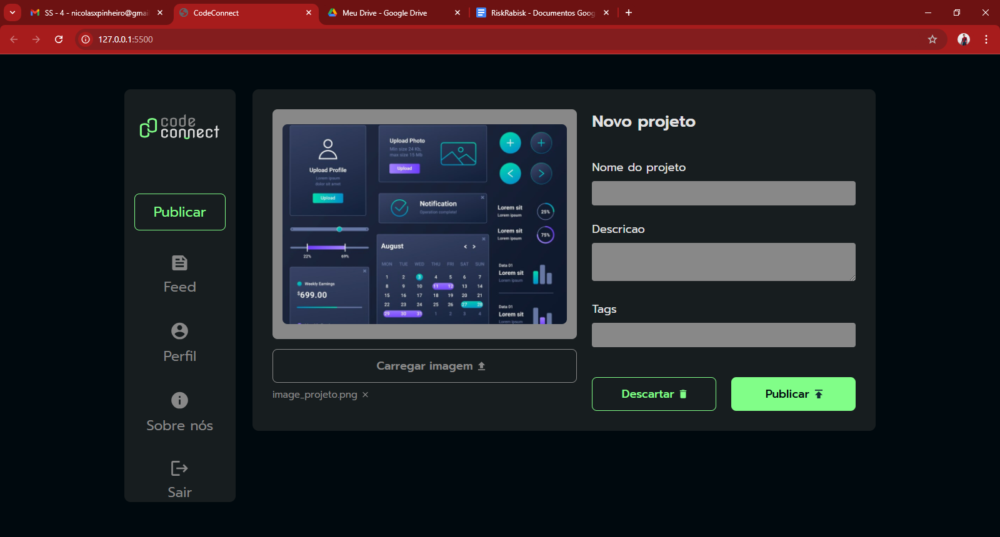

## Desafios: Exercícios
#### Projeto : javascript-assincrono
#### Data    : 18/12/2024

#### Formação
[Desenvolvimento Front-end: cursos para criar aplicações web com HTML, CSS e JavaScript](https://cursos.alura.com.br/formacao-javascript-front-end);

#### Curso
[Curso de JavaScript: entendendo promises e async/await](https://cursos.alura.com.br/course/javascript-entendendo-promises-async-await/task/162885);

